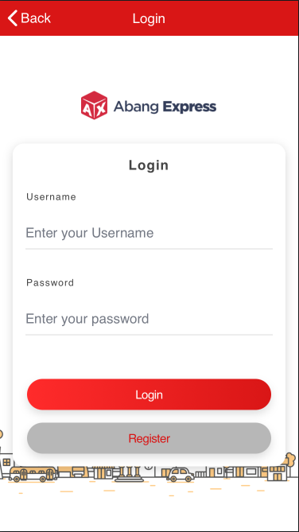

  
  
  

Abang Express Mobile Application is an app i created that functioning as basic application for the companies transactions, such as :  create a booking, tracking the package, or see your booking list, etc.  

For this project, I was the  programmer who was responsible for developing and publishing this app.  

For the code itself is saving under a private repositories in Github because it contains a private data companies use.

From now on, this apps has been removed from google play store due to companies request, so i'm no longer have business with them anymore.

If you want to discuss on this project, or have something to talk about. Feel free to [contact me](indrapalijama.github.io) or simply just run `npx indrapalijama` from your terminal!

