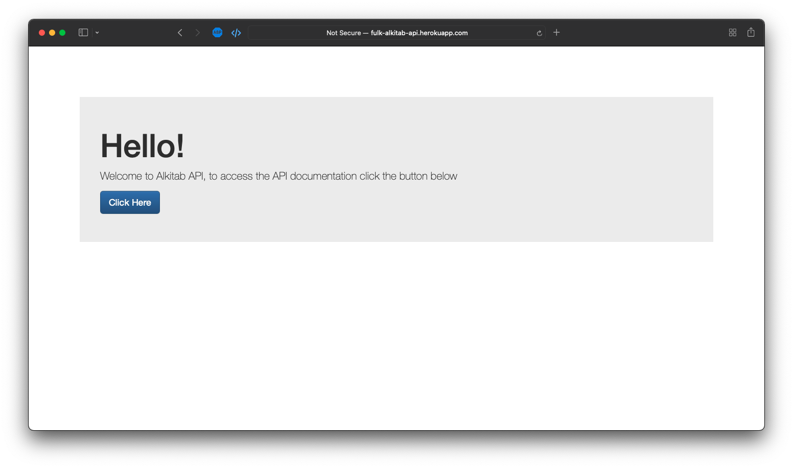
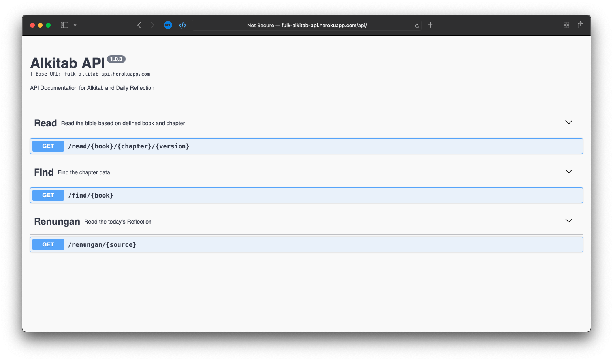

  
  

Backend application to fetch Bible passages and daily devotional content.

This application was created to fetch Bible passages and daily devotional content. 

It was made while learning web scraping using Cheerio.

The code for this project is available in my  [repo](https://github.com/indrapalijama/alkitab-api-v2). 

If you would like to discuss this project or have any questions, feel free to contact [contact me](indrapalijama.github.io) or simply just run `npx indrapalijama` from your terminal!

