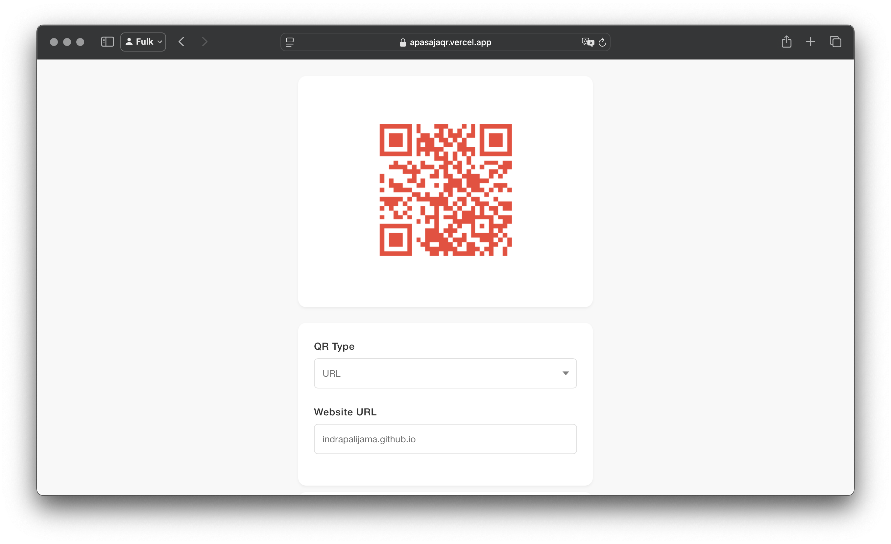
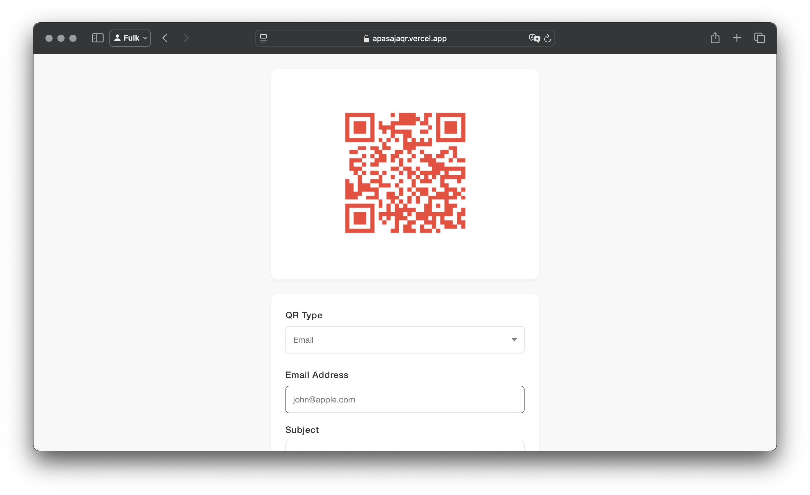

  
  

This project is a mobile application built with Ionic Framework that allows users to generate QR codes for any text, URL, or contact information. The app features a simple and intuitive interface that makes it easy to create and share QR codes on-the-go.

Here's the [Demo](https://apasajaqr.vercel.app)

Some key features of the application include:

- Seamless QR code generation from user input
- Ability to save generated QR codes to the device's gallery
- Sharing options to quickly distribute the QR codes
- Responsive design that works on both iOS and Android devices
- Supports generating QR codes for text, URLs, and contact information
- Provides a clean and modern user interface
- Allows users to customize the QR code's color and size

The code for this project is available on my [GitHub repository](https://github.com/indrapalijama/mobile-qr-generator). 

If you would like to discuss this project or have any questions, feel free to contact [contact me](indrapalijama.github.io) or simply just run `npx indrapalijama` from your terminal!