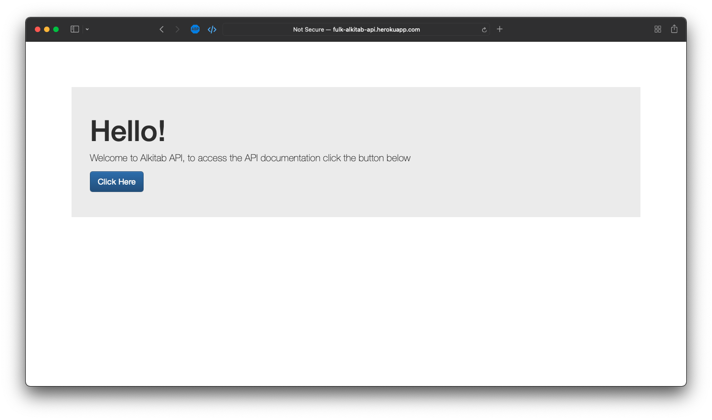
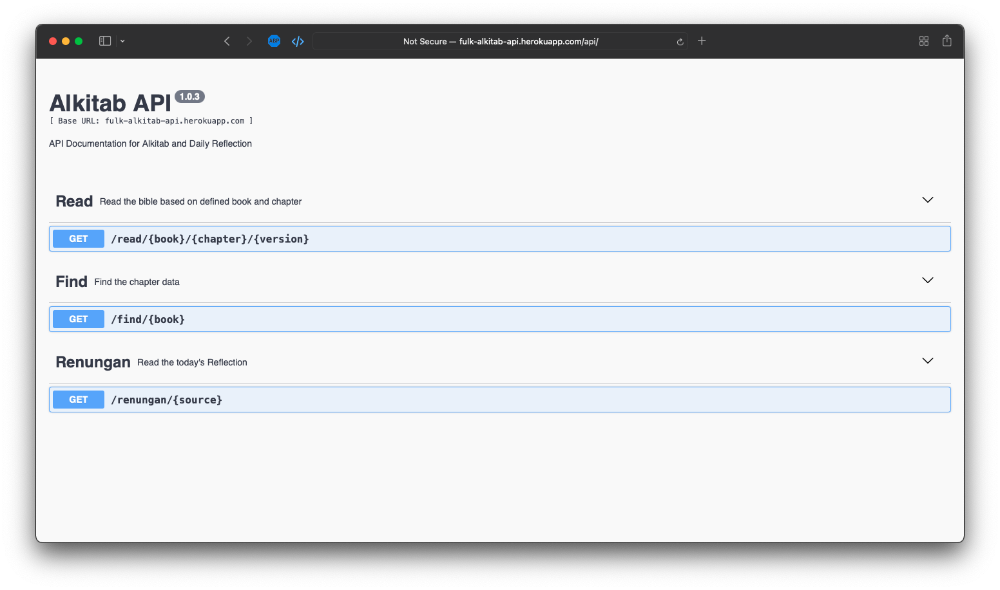

  
  

The Holy Bible / Alkitab API is a comprehensive RESTful backend application built with ExpressJS that serves Bible passages and daily devotional content. The API utilizes web scraping techniques with Cheerio to fetch content from various sources and provides endpoints for searching and retrieving specific verses, books, and devotional materials.

## Key Features

- **Multi-language Support**: Serves both English and Indonesian Bible versions
- **Comprehensive Search**: Search and retrieve specific verses, chapters, and books
- **Daily Devotionals**: Access to daily devotional content and materials
- **RESTful Architecture**: Well-structured API endpoints following REST principles
- **Web Scraping Integration**: Automated content fetching using Cheerio
- **Multiple Translations**: Support for various Bible translations

## API Endpoints

The API provides several endpoints for accessing biblical content:

- **Verse Retrieval**: Get specific Bible verses by book, chapter, and verse number
- **Chapter Access**: Retrieve entire chapters from any book of the Bible
- **Search Functionality**: Search for specific terms or phrases across translations
- **Daily Content**: Access daily devotional materials and readings
- **Translation Support**: Switch between different Bible versions and languages

## Technical Implementation

The backend is built using ExpressJS and Node.js, providing a robust and scalable foundation. Web scraping is implemented using Cheerio, allowing the API to fetch content from various online Bible resources while maintaining data consistency and reliability.

## Technologies Used

- **Backend Framework**: ExpressJS
- **Runtime Environment**: Node.js
- **Web Scraping**: Cheerio
- **API Architecture**: RESTful design principles
- **Languages Supported**: English and Indonesian

This project showcases backend development skills, API design principles, web scraping techniques, and the ability to create scalable solutions that serve religious and educational content to users across different languages and translations.

## Repository
the code for this project is available in my [repo](https://github.com/indrapalijama/alkitab-api-v2)
