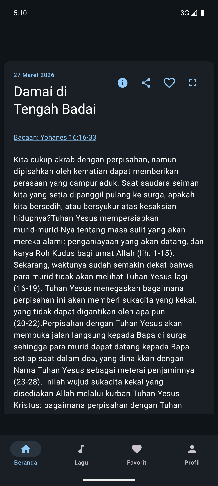
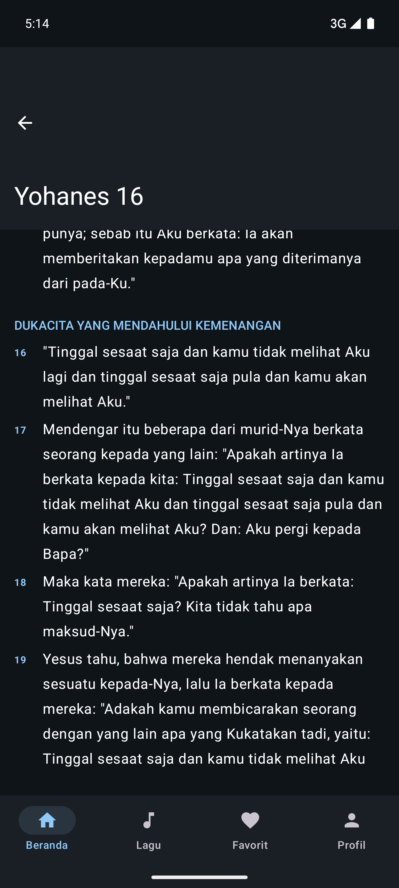
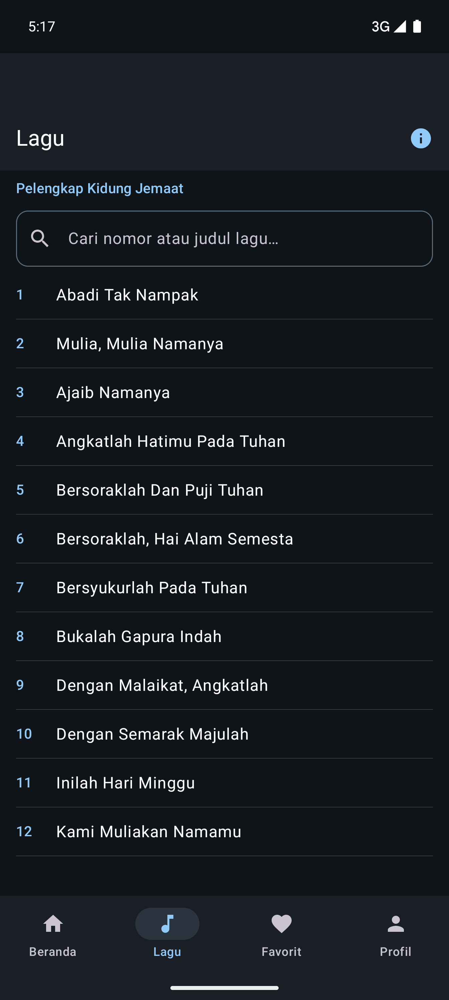
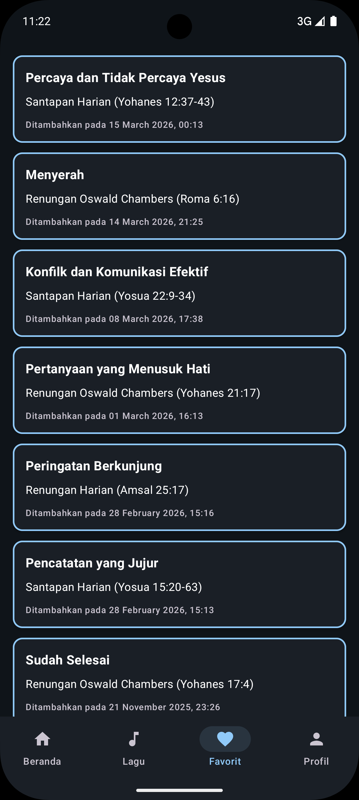

  
  
  
  

Daily Reflection (Renungan Harian) is a modern, local-first Android application designed as a quiet-time companion for daily devotionals, Bible reading, and worship. Built natively using Kotlin, Jetpack Compose, and Material 3, the app integrates daily readings from trusted Indonesian Christian sources, a canonical 66-book Scripture reader with multiple translations, four comprehensive hymnal songbooks with on-demand MIDI instrument audio playback, and generative AI summaries.

The app interfaces directly with the [Holy Bible / Alkitab API](../projects/bible-api) backend to fetch up-to-date devotional content while maintaining full offline capabilities.

## Core Functionalities

- **Daily Devotionals**: Access reflections from multiple trusted sources (Santapan Harian, Renungan Harian, and Renungan Oswald Chambers) in one unified interface.
- **Dedicated Bible Reader**: Full 66-book canonical Scripture reader with instant chapter grid navigation, two-column verse alignment, and multi-translation support (TB, NIV, KJV).
- **Hymnal Songbooks with Audio**: Complete lyrics for four major hymnals (Kidung Jemaat, Pelengkap Kidung Jemaat, Nyanyikanlah Kidung Baru, and Nyanyian GPM) featuring on-demand MIDI instrument playback controls.
- **AI Devotional Summaries**: Powered by Google Gemini 2.5 Flash Lite to provide key insights, actionable takeaways (*Aksi Hari Ini*), and short prayers (*Doa Singkat*).
- **Local-First & Offline Resilience**: Built with encrypted Room databases (SQLCipher via Android Keystore) and Cloudflare R2 downloads for full offline reading capability without requiring network connectivity.
- **Audio Text-to-Speech (TTS)**: High-quality Indonesian speech synthesis with specialized theological pronunciation handling (e.g. divine names and passage citations).
- **Favorites, Highlights & Cloud Sync**: Save favorite passages and reflections with customizable text highlighting, synced seamlessly across devices via Firebase and Cloud Firestore.
- **Biometric Security & Reading Streaks**: Optional biometric authentication (BiometricPrompt) for privacy, personalized reading streak counters, and home-screen glanceable widget.

## Key Features

### Modern Jetpack Compose Architecture
The user interface is entirely built with Jetpack Compose and Material 3, featuring edge-to-edge system bar integration, dynamic day/night theming, adaptive navigation (bottom navigation bar and tablet navigation rail), and fluid animations.

### Multi-Translation Bible Study
Readers can switch on-the-fly between Terjemahan Baru (TB), New International Version (NIV), and King James Version (KJV). The reading progress auto-resumes smoothly where the user left off.

### Four Hymnals with MIDI Playback
Includes full hymn catalogs for KJ (478 hymns), PKJ (308 hymns), NKB (230 hymns), and Nyanyian GPM (353 hymns). Users can stream or download MIDI accompaniments for rehearsal or personal worship.

### Generative AI Integration
Integrated with Google Generative AI SDK using Gemini 2.5 Flash Lite to extract structured reflections, encouraging deeper contemplation through succinct summaries and daily actionable challenges.

## Deployment & Availability

The application is deployed and available on the Google Play Store:

- **Google Play Store**: [Daily Reflection on Google Play](https://play.google.com/store/apps/details?id=fulk.evilcorp.dailyreflection)
- **Status**: Live (v1.9.0)
- **Target Platform**: Android 7.0+ (API 24 to 36)

<a href="https://play.google.com/store/apps/details?id=fulk.evilcorp.dailyreflection" target="_blank" rel="noopener noreferrer" class="ui basic button">
  <i class="android icon"></i> View on Google Play Store
</a>

## Technologies Used

- **Operating System**: Android Native
- **Programming Language**: Kotlin
- **UI Framework**: Jetpack Compose & Material 3
- **Local Storage**: Room 2.7.0, SQLCipher 4.17.0, Jetpack DataStore Preferences
- **AI & Cloud Services**: Google Gemini 2.5 Flash Lite, Firebase Authentication, Cloud Firestore, Cloudflare R2
- **Networking**: Retrofit, OkHttp, Gson
- **In-App APIs**: Google Play In-App Review API, In-App Update API
- **Audio & Media**: Android Text-to-Speech (TTS), MediaPlayer (MIDI playback)
- **CI/CD & Automation**: GitHub Actions, Semantic Release, Fastlane
