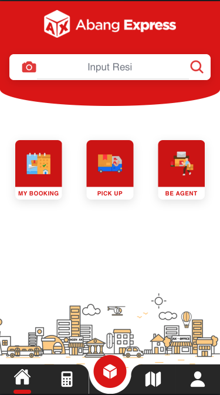
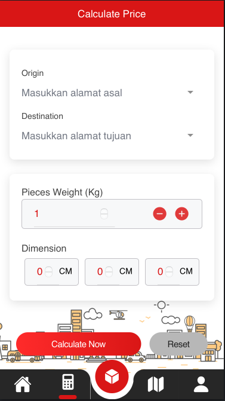

  
  
  

The Logistic Delivery Mobile App is a comprehensive solution developed for shipping companies using Ionic Framework and Angular. This application provides end-to-end logistics management capabilities, from booking creation to package tracking, with a focus on user experience and operational efficiency.

## Core Functionalities

- **Booking Creation**: Streamlined process for creating new shipping bookings
- **Package Tracking**: Real-time tracking of packages throughout the delivery process
- **Booking History**: Complete history and review system for past bookings
- **Cost Calculator**: Advanced shipping cost calculator with dimensional weight support
- **Secure Authentication**: Robust authentication system for user account management
- **Cross-platform Support**: Seamless experience across iOS and Android devices

## Key Features

### Booking Management
The application provides an intuitive booking creation system that allows users to:
- Input package details including dimensions and weight
- Select pickup and delivery locations
- Choose delivery options and time preferences
- Generate booking confirmations and tracking numbers

### Advanced Tracking System
Real-time package tracking with:
- GPS-based location updates
- Delivery status notifications
- Estimated delivery time calculations
- Photo proof of delivery integration

### Cost Calculation Engine
Sophisticated pricing system featuring:
- Dimensional weight calculations
- Distance-based pricing
- Service type variations
- Real-time pricing updates

## Technical Implementation

The application is built using the Ionic Framework with Angular, providing a robust foundation for cross-platform mobile development. The architecture ensures optimal performance while maintaining code reusability across different platforms.

## Deployment

The application was successfully deployed to the Google Play Store, demonstrating proficiency in:
- App store compliance and submission processes
- Production-ready code optimization
- User interface guidelines adherence
- Performance optimization for mobile devices

Note : Due to the company's request, this application has been removed from the Google Play Store.

## Repository
The developer was responsible for the programming and publishing of this application. The code is saved in a private GitHub repository as it contains confidential company data.

## Technologies Used

- **Frontend Framework**: Ionic Framework
- **JavaScript Framework**: Angular
- **Mobile Platforms**: iOS and Android
- **Authentication**: Secure user authentication system
- **Deployment**: Google Play Store

This project demonstrates comprehensive mobile development skills, logistics domain expertise, and the ability to deliver production-ready applications that serve real business needs in the shipping and logistics industry.