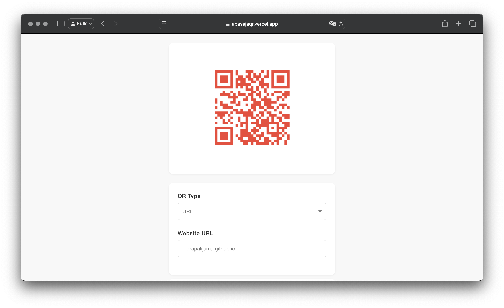

  
  

The Mobile QR Code Generator is a comprehensive mobile application developed using the Ionic Framework and TypeScript. This cross-platform application enables users to generate QR codes for various types of content including text, URLs, and contact information with an intuitive and user-friendly interface.

## Key Features

- **Multi-format Support**: Generate QR codes for text, URLs, contact information, and more
- **Customization Options**: Customize QR code colors and sizes to match user preferences
- **Device Integration**: Save generated QR codes directly to device gallery
- **Cross-platform Compatibility**: Seamless functionality across both iOS and Android platforms
- **Responsive Design**: Optimized UI/UX for various screen sizes and orientations

## Technical Implementation

The application leverages the Ionic Framework's cross-platform capabilities combined with TypeScript's type safety to deliver a robust and maintainable codebase. The app integrates with native device features for gallery access and implements efficient QR code generation algorithms.

## Technologies Used

- **Frontend Framework**: Ionic Framework
- **Programming Language**: TypeScript
- **Platforms**: iOS and Android
- **Native Integration**: Capacitor for device feature access

This project demonstrates proficiency in cross-platform mobile development, user experience design, and integration with native device capabilities while maintaining code quality and performance across different mobile platforms.

## Demo
Check out this [demo](https://apasajaqr.vercel.app)!